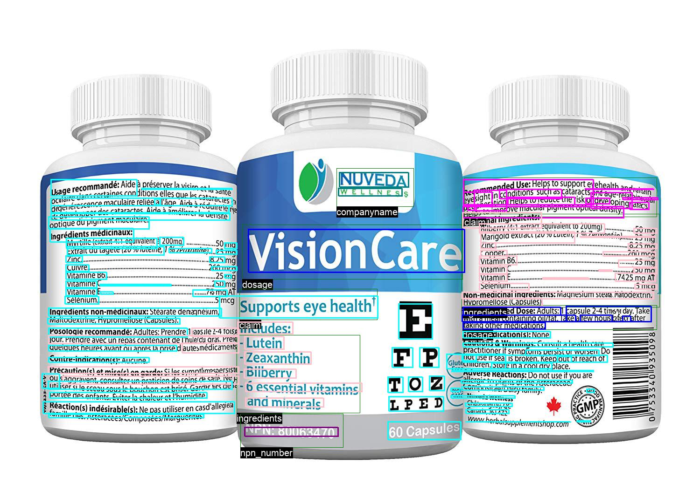
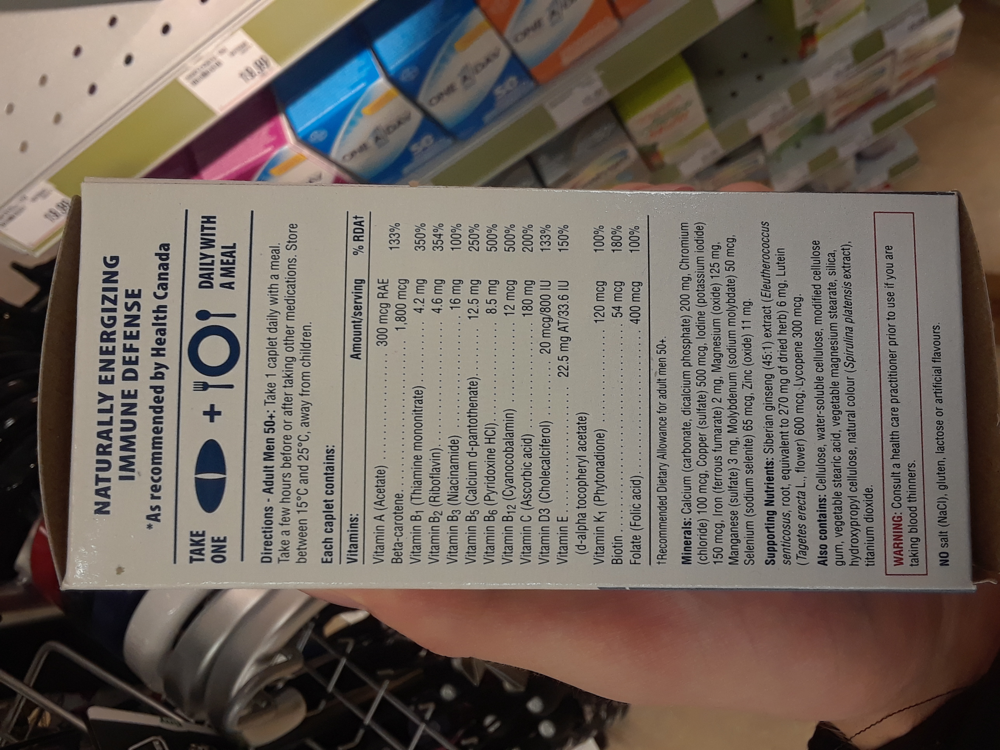
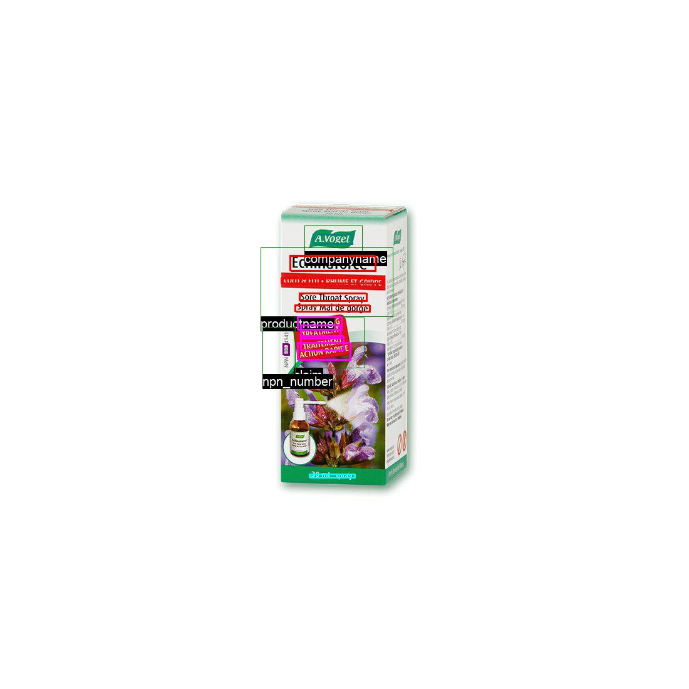
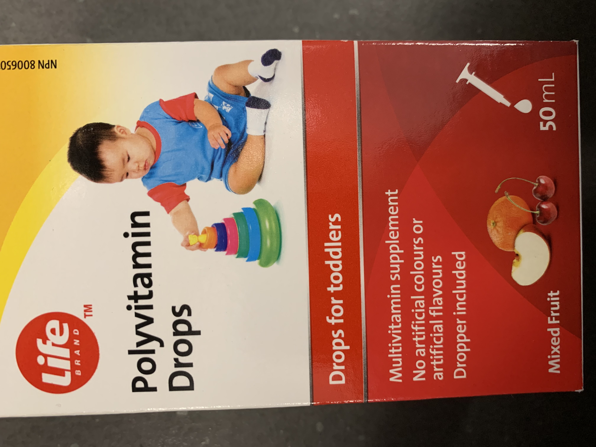
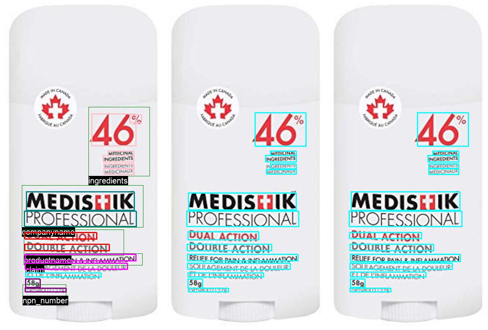
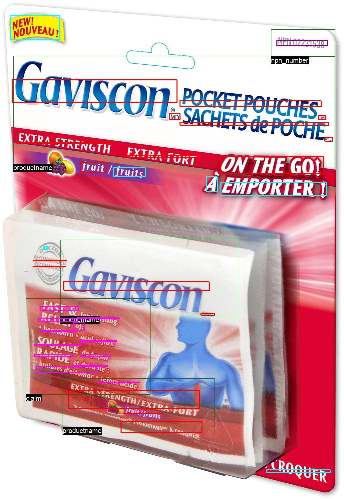

### Limitations
Below are some of the limitations observed during the course of this project

| S.No | Example        | Description   |
|:---  |     :---:      |          :--- |
|1     |      |*Multiple images*: Having multiple faces of a product combined in a single view|
|2     |      |*Orientation of images*: Majority of the mobile phone images annotated had the incorrect orientation. We had to manually fix it by iterating over more than 1000 images.   |
|3     |      |*Quaity of images*: Since a lot of images provided were web-scrapped, the quality was significantly poor in comparision to the ones taken by a mobile phone.  |
|4     |      |*Cropped images*: Some images did not capture the entire face of the product and vital information was cropped off (eg: NPN)  |
|5     |      |*Curved surfaces*: Since the curved surfaces also have information on the sides, and the GraphIE algorithm cannot differentiate based on the curvature, a lot of noise is added while grouping tokens.  |
|6     |      |*Partial annotations*: During the annotation process, some portions were missed. Also french sections were not annotated that had the same spelling as in english. It affects the way text classifier learns this conflicting information|
|7     |      |*3D images*: The web-scrapped images were taken in 3-D while our analysis is done in 2-D. This results in a lot of noise being added while grouping tokens.  |
|8     |        |*Lack of mobile phone images*: Since this application is catered for images taken in the field by a mobile phone, there weren't a lot of images in the dataset replicating this.  Also a lot of webscrapped images had just the front of product without ingredients or claims assoicated with it.|

### Future Work
For the next iteration of this project, below are some ideas listed as part of our future work:

- **See: [notes on production deployment](../docs/production.md), specifically regarding cluster orchestration/high compute requirements**
- Get access to high-quality mobile phone images passively labelled  by inspectors while using our application
- Imporve the distancing parameters used for GraphIE algorithm
- Use different token grouping strategies while feeding our classification model

- *Write about TRDG (Alex)*
- *Write about imporved proposal mechanism (Joanne)*
- *Write about different neural network architecture (eg: CRF) (Nick)*
- *Features to the app (Andreas)*
